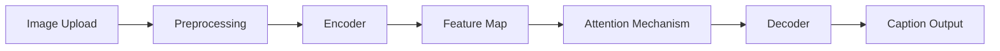

# **Image Captioning with Attention (End-to-End ML System)**

An end-to-end deep learning system that generates natural language captions for images using an Encoder-Decoder architecture with Attention.  
The system is fully deployed using Docker and Hugging Face Spaces, with CI/CD integration from GitHub.

---

## 📌 Project Overview

This project builds a complete pipeline for **image caption generation**, combining:

- Computer Vision (CNN Encoder)
- Natural Language Processing (LSTM Decoder)
- Attention Mechanism for visual focus
- Beam Search for improved inference
- Full-stack deployment with React + FastAPI

👉 The system takes an image as input and generates a meaningful caption describing the scene.

---

## ✨ Features

- 🖼️ Image Caption Generation
- 🎯 Attention Heatmap Visualization
- ⚡ Greedy + Beam Search Decoding
- 🌐 Full-stack Web Interface (React)
- 🚀 Deployed on Hugging Face Spaces (Dockerized)
- 🔄 CI/CD via GitHub Actions
- 📦 Model + Vocabulary hosted on Hugging Face Hub

---

## 🎬 Demo

> Add screenshots / GIF here

---

## 🏗️ System Architecture

```mermaid
flowchart LR
    A[User] --> B[React Frontend]
    B --> C[FastAPI Backend]
    C --> D[Model Loader]
    D --> E[Encoder - CNN]
    E --> F[Decoder - LSTM + Attention]
    F --> G[Generated Caption]
    D --> H[Hugging Face Hub]
````

---

## 🧠 Model Architecture (High-Level)

* **Encoder**: Pretrained CNN (ResNet) extracts visual features
* **Decoder**: LSTM generates captions word-by-word
* **Attention**: Focuses on relevant image regions at each step

---

## 🛠️ Tech Stack

### Backend

* FastAPI
* PyTorch
* Torchvision
* NLTK

### Frontend

* React (Vite)
* TailwindCSS

### Deployment

* Docker
* Hugging Face Spaces
* Hugging Face Hub

### CI/CD

* GitHub Actions

---

## 🐳 Deployment Architecture

```mermaid
flowchart LR
    A[GitHub Repo] --> B[GitHub Actions]
    B --> C[Hugging Face Spaces]
    C --> D[Docker Container]
    D --> E[FastAPI + React App]
    E --> F[User Access]
    D --> G[HF Hub Model Download]
```

---

## ⚙️ How to Run Locally

### 1. Clone Repository

```bash
git clone https://github.com/your-username/image-captioning.git
cd image-captioning
```

---

### 2. Backend Setup

```bash
cd backend
pip install -r requirements.txt
```

---

### 3. Frontend Setup

```bash
cd ../frontend
npm install
npm run build
```

---

### 4. Run Application

```bash
uvicorn backend.app.api:app --reload
```

---

### 5. Open in Browser

```
http://localhost:8000
```

---

## 🧪 How to Train the Model

Training is handled separately from inference.

```bash
python -m app.main
```

### Training Includes:

* Dataset: Flickr8k
* Vocabulary creation
* CNN Encoder + LSTM Decoder training
* Teacher forcing
* BLEU score evaluation

---

## 📊 Inference Flow



---

## 🧠 Key Design Decisions

### 🔹 Why Hugging Face Hub (instead of Git LFS)?

* Efficient model hosting
* Easy versioning
* Runtime download support

### 🔹 Why Docker Deployment?

* Reproducibility
* Environment consistency
* Easy scaling

### 🔹 Why Attention Mechanism?

* Improves caption quality
* Enables interpretability (heatmaps)

### 🔹 Why Beam Search?

* Avoids greedy local optimum
* Produces more coherent sentences

### 🔹 Why Separate Training & Inference?

* Faster deployment
* Smaller runtime footprint
* Cleaner architecture

---

## ⚠️ Limitations

* Limited dataset (Flickr8k)
* Struggles with complex scenes
* Not optimized for real-time inference at scale

---

## 🚀 Future Improvements

* Use larger datasets (MSCOCO)
* Transformer-based models (ViT + GPT)
* Better evaluation metrics (CIDEr, METEOR)
* Model quantization for faster inference
* Add authentication & user history

---

## 📌 Final Notes

This project demonstrates:

* Deep Learning (CV + NLP)
* System Design
* Full-stack development
* Model deployment (MLOps)

---

## 🙌 Acknowledgements

* Flickr8k Dataset
* PyTorch
* Hugging Face Ecosystem

---
