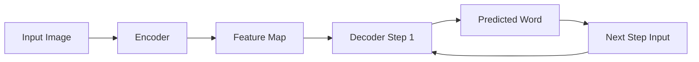
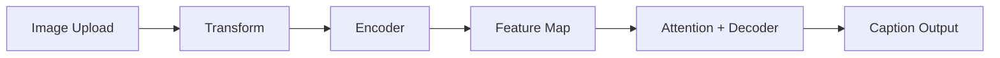
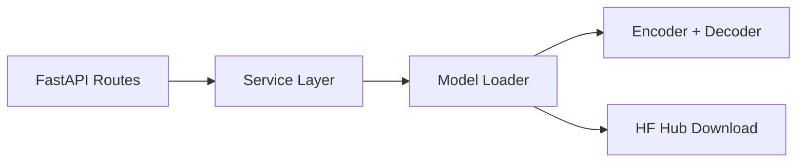

# **Backend: Image Captioning System (Deep Learning + Architecture)**

This document provides a deep technical overview of the backend system powering the Image Captioning application.  
It covers the **ML pipeline, model architecture, training strategy, inference flow, and system design decisions**.

---

## 📌 Problem Statement

Generate meaningful natural language captions from images.

### Challenges:
- Understanding visual content (objects, actions, context)
- Mapping visual features to sequential language
- Maintaining grammatical and semantic coherence

---

## 📂 Dataset

- **Dataset Used**: Flickr8k
- ~8,000 images with 5 captions each

### Why Flickr8k?
- Lightweight → faster experimentation
- Good for prototyping end-to-end pipeline
- Balanced complexity for CNN + RNN models

---

## 🧠 Model Architecture

### Overview

```mermaid
flowchart LR
    A[Input Image] --> B[Encoder CNN (ResNet)]
    B --> C[Feature Map (7x7x2048)]
    C --> D[Attention Mechanism]
    D --> E[Context Vector]
    E --> F[Decoder (LSTM)]
    F --> G[Word Prediction]

```
---

### 🔍 Encoder (CNN)

- Pretrained ResNet (feature extractor)
- Removes final classification layer
- Outputs spatial feature map:
`(B, 2048, 7, 7)`

#### Why remove global pooling?

- Preserves spatial information
- Enables attention over image regions

---

### 🔤 Decoder (LSTM)

- Input:
    - Previous word embedding
    - Context vector (from attention)

- Output:
    - Probability distribution over vocabulary

---

### 🎯 Attention Mechanism

- Concept
    - Instead of using a single fixed vector, the model dynamically focuses on different regions of the image.

- Flow


- Why Attention?

    - Improves caption accuracy
    - Handles multi-object scenes
    - Enables interpretability (heatmaps)

---

### 🔄 Training Pipeline

```mermaid
flowchart LR
    A[Image + Caption] --> B[Preprocessing]
    B --> C[Vocabulary Encoding]
    C --> D[Encoder]
    D --> E[Decoder (Teacher Forcing)]
    E --> F[Loss Computation]
    F --> G[Backpropagation]

```

---

## Key Components

### 🔹 Vocabulary

- Built using frequency threshold
- Special tokens: 
    - `<start>`, `<end>`, `<pad>`, `<unk>`

### 🔹 Teacher Forcing

- Ground-truth word is fed at each step
- Prevents error accumulation during training

### 🔹 Loss Function

`CrossEntropyLoss (ignore padding tokens)`

### 🔹 Optimization

- Adam optimizer
- Gradients computed over all time steps

---

## ⚙️ Inference Pipeline


---

## 🧠 Decoding Strategies

### 🔹 Greedy Decoding

- Select highest probability word at each step
    - Pros: Fast
    - Cons: Suboptimal sequences

### 🔹 Beam Search

- Keeps top-k sequences at each step
    - Pros: Better sentence quality
    - Cons: More computation

---

## 📊 Evaluation

### BLEU Score

- Measures overlap with ground-truth captions
- Observed:
```
    Greedy: ~0.14
    Beam: ~0.42
```

### Insight

- Beam search significantly improves performance
- Dataset size limits final score

---

## 🔁 Runtime Data Flow



---

## 🧩 Attention Visualization Flow

```mermaid
flowchart LR
    A[Feature Map] --> B[Attention Weights]
    B --> C[Reshape (7x7)]
    C --> D[Upsample to Image Size]
    D --> E[Overlay Heatmap]

```

---

## 🏗️ System Architecture (Backend)



---

## 📦 Model & Vocabulary Handling

- Model (`model.pth`) stored on Hugging Face Hub
- Vocabulary (`vocab.json`) also hosted on HF

### Runtime Behavior:

- Downloads if not available locally
- Cached for reuse

---

## 🧠 Design Decisions

### 🔹 Why CNN + LSTM?

- Simpler and interpretable baseline
- Works well for small datasets

### 🔹 Why Attention?

- Adds spatial reasoning
- Improves performance significantly

### 🔹 Why Separate Encoder & Decoder?

- Modular design
- Easier experimentation

### 🔹 Why HF Hub for Model Storage?

- Avoids Git size limits
- Enables dynamic loading
- Clean deployment

### 🔹 Why Cache Model?

- Avoid repeated downloads
- Improves response time

---

## ⚠️ Limitations

- Small dataset → limited generalization
- LSTM less powerful than transformers
- Beam search increases latency

---

## 🚀 Future Improvements

- Replace LSTM with Transformer (e.g., ViT + GPT)
- Use larger datasets (MSCOCO)
- Add model quantization
- Batch inference optimization
- Add caching for predictions

---

## 📌 Summary

#### This backend demonstrates:

- End-to-end ML pipeline design
- Attention-based sequence modeling
- Efficient deployment architecture
- Scalable model serving strategy

---
