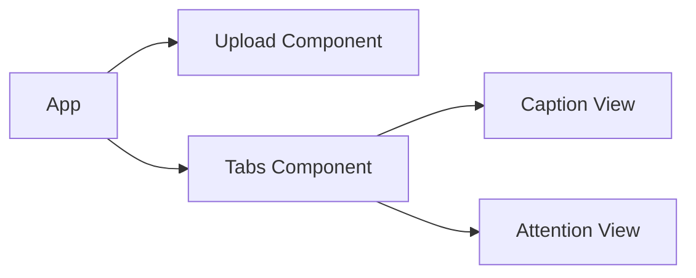
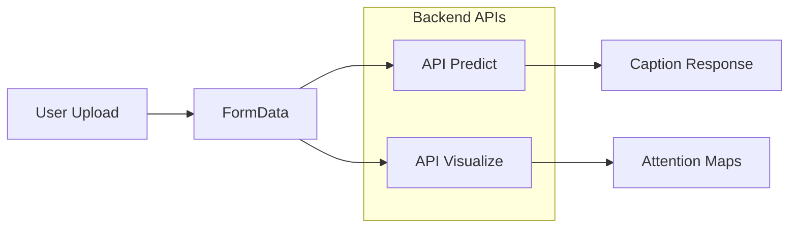
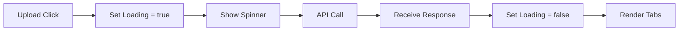
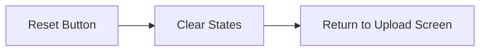

# **Frontend: Image Captioning Interface (UI + Service Layer)**

This document describes the frontend layer of the Image Captioning system.  
The frontend is responsible for **user interaction, visualization, and communication with the backend ML service**.

---

## 📌 Overview

The frontend provides an intuitive interface where users can:

- Upload an image
- Generate captions
- Visualize attention heatmaps
- Toggle between results
- Reset and test new inputs

---

## 🧭 UI Flow

```mermaid
flowchart LR
    subgraph Results
        direction TB
        C[Caption Tab]
        D[Attention Tab]
    end
    A[Upload Image] --> B[Loading State]
    B --> C
    C <--> D
    C --> E[Reset]
    B --> D
    D --> E
    E --> F[Done]
````

---

## 🧠 Frontend Role in System

The frontend acts as a **presentation and service layer**, while all ML computation happens in the backend.

### System Interaction

```mermaid
flowchart LR
    A[User] --> B[React UI]
    B --> C[FastAPI Backend]
    C --> D[Model Inference]
    D --> C
    C --> B
    B --> A
```

---

## ⚙️ Tech Stack

* React (Vite)
* TailwindCSS
* Axios (API calls)

---

## 🧩 Component Architecture



### Key Components

### 🔹 Upload Component

* Handles image selection
* Triggers API calls
* Manages loading state

### 🔹 Tabs Component

* Toggles between:

  * Caption view
  * Attention visualization

### 🔹 Caption View

* Displays generated caption

### 🔹 Attention View

* Displays attention heatmap overlay

---

## 🔄 API Integration

### Endpoints Used

```text
POST /api/predict
POST /api/visualize
```

### Request Flow



### Response Handling

* Caption stored in state
* Attention maps rendered as images
* UI updated dynamically

---

## 🧠 State Management

Key states:

```text
image        → uploaded image preview
caption      → generated caption
attention    → heatmap output
loading      → API call state
loaded       → result ready flag
activeTab    → UI toggle
```

---

## ⏳ Loading Behavior



### Why This Matters

* Prevents UI freeze
* Improves user experience
* Clearly separates system states

---

## 🔁 Reset Flow



---

## 🎯 Design Decisions

### 🔹 Why Separate Tabs?

* Avoid cluttered UI
* Clear distinction between:

  * Caption output
  * Attention visualization

### 🔹 Why Show Image Preview?

* Improves user trust
* Confirms correct input

### 🔹 Why Loading Spinner?

* Prevents confusion during inference delay
* Enhances perceived performance

### 🔹 Why Use FormData?

* Required for file upload
* Compatible with FastAPI UploadFile

### 🔹 Why Keep Frontend Stateless (for ML)?

* All ML logic handled in backend
* Keeps frontend lightweight and scalable

---

## ⚠️ Limitations

* No drag-and-drop upload (can be added)
* No progress bar for long inference
* No caching of previous results

---

## 🚀 Future Improvements

* Drag-and-drop upload
* Image history
* Download caption feature
* Mobile responsiveness improvements
* Progressive loading for attention maps

---

## 📌 Summary

#### The frontend is designed to:

* Provide a clean and intuitive interface
* Act as a bridge between user and ML backend
* Visualize model outputs effectively
* Maintain a responsive and smooth user experience

---
